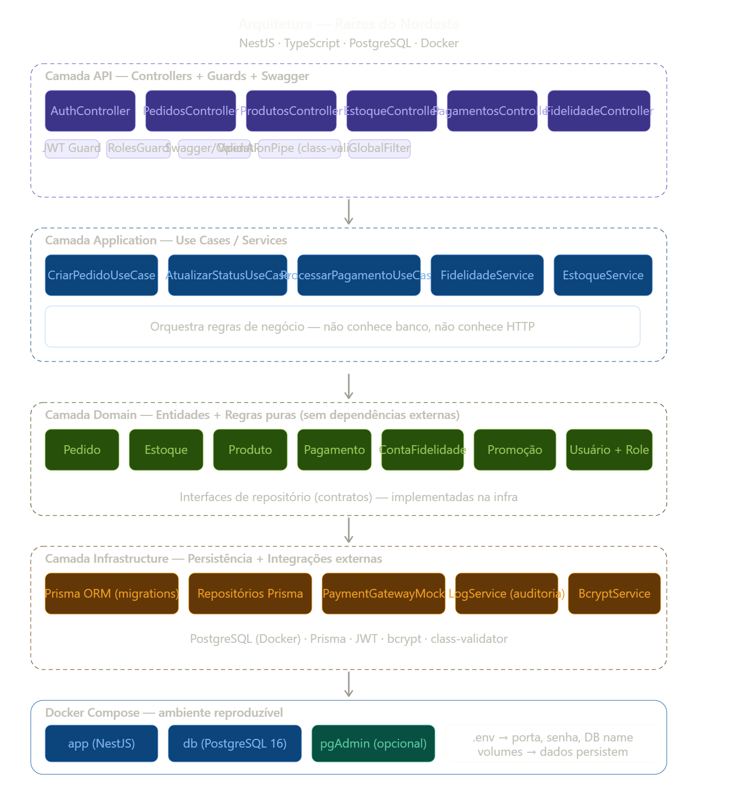

<p align="center">
  <a href="http://nestjs.com/" target="blank"></a>
</p>

[circleci-image]: https://img.shields.io/circleci/build/github/nestjs/nest/master?token=abc123def456
[circleci-url]: https://circleci.com/gh/nestjs/nest

  <p align="center">A progressive <a href="http://nodejs.org" target="_blank">Node.js</a> framework for building efficient and scalable server-side applications.</p>
    <p align="center">
<a href="https://www.npmjs.com/~nestjscore" target="_blank"></a>
<a href="https://www.npmjs.com/~nestjscore" target="_blank"></a>
<a href="https://www.npmjs.com/~nestjscore" target="_blank"></a>
<a href="https://circleci.com/gh/nestjs/nest" target="_blank"></a>
<a href="https://discord.gg/G7Qnnhy" target="_blank"></a>
<a href="https://opencollective.com/nest#backer" target="_blank"></a>
<a href="https://opencollective.com/nest#sponsor" target="_blank"></a>
  <a href="https://paypal.me/kamilmysliwiec" target="_blank"></a>
    <a href="https://opencollective.com/nest#sponsor"  target="_blank"></a>
  <a href="https://twitter.com/nestframework" target="_blank"></a>
</p>
  <!--[](https://opencollective.com/nest#backer)
  [](https://opencollective.com/nest#sponsor)-->

## Description

[Nest](https://github.com/nestjs/nest) framework TypeScript starter repository.

## Project setup

```bash
$ npm install
```

## Compile and run the project

```bash
# development
$ npm run start

# watch mode
$ npm run start:dev

# production mode
$ npm run start:prod
```

## Run tests

```bash
# unit tests
$ npm run test

# e2e tests
$ npm run test:e2e

# test coverage
$ npm run test:cov
```

## Deployment

When you're ready to deploy your NestJS application to production, there are some key steps you can take to ensure it runs as efficiently as possible. Check out the [deployment documentation](https://docs.nestjs.com/deployment) for more information.

If you are looking for a cloud-based platform to deploy your NestJS application, check out [Mau](https://mau.nestjs.com), our official platform for deploying NestJS applications on AWS. Mau makes deployment straightforward and fast, requiring just a few simple steps:

```bash
$ npm install -g @nestjs/mau
$ mau deploy
```

With Mau, you can deploy your application in just a few clicks, allowing you to focus on building features rather than managing infrastructure.

## Resources

Check out a few resources that may come in handy when working with NestJS:

- Visit the [NestJS Documentation](https://docs.nestjs.com) to learn more about the framework.
- For questions and support, please visit our [Discord channel](https://discord.gg/G7Qnnhy).
- To dive deeper and get more hands-on experience, check out our official video [courses](https://courses.nestjs.com/).
- Deploy your application to AWS with the help of [NestJS Mau](https://mau.nestjs.com) in just a few clicks.
- Visualize your application graph and interact with the NestJS application in real-time using [NestJS Devtools](https://devtools.nestjs.com).
- Need help with your project (part-time to full-time)? Check out our official [enterprise support](https://enterprise.nestjs.com).
- To stay in the loop and get updates, follow us on [X](https://x.com/nestframework) and [LinkedIn](https://linkedin.com/company/nestjs).
- Looking for a job, or have a job to offer? Check out our official [Jobs board](https://jobs.nestjs.com).

## Support

Nest is an MIT-licensed open source project. It can grow thanks to the sponsors and support by the amazing backers. If you'd like to join them, please [read more here](https://docs.nestjs.com/support).

## Stay in touch

- Author  - [Kamil Myśliwiec](https://twitter.com/kammysliwiec)
- Website - [https://nestjs.com](https://nestjs.com/)
- Twitter - [@nestframework](https://twitter.com/nestframework)

## License

Nest is [MIT licensed](https://github.com/nestjs/nest/blob/master/LICENSE).


# Raizes do Nordeste - About

## Stack

NestJS + TypeScript
Prisma como ORM
PostgreSQL
Docker

## Project Dependencies

- WSL Ubuntu: 24.04.4 
- Node v24.15.0
- npm 11.12.1
- Docker 29.2.1

## Project Architecture



### Folder Structure

```bash
src/
├── modules/
│   ├── auth/
│   │   ├── auth.controller.ts
│   │   ├── auth.service.ts
│   │   ├── guards/         ← JwtAuthGuard, RolesGuard
│   │   └── strategies/     ← JwtStrategy (Passport)
│   ├── orders/
│   │   ├── orders.controller.ts
│   │   ├── use-cases/
│   │   │   ├── create-order.use-case.ts
│   │   │   └── update-status.use-case.ts
│   │   └── orders.module.ts
│   ├── payments/
│   │   ├── payments.controller.ts
│   │   ├── use-cases/
│   │   │   └── payment-process.use-case.ts
│   │   └── mock/
│   │       └── payment-gateway.mock.ts  ← Mock is Here
│   ├── inventory/
│   ├── loyalty/
│   └── products/
├── domain/
│   ├── entities/           ← Pure Classes, No Prisma
│   └── repositories/       ← interfaces (contracts)
├── infrastructure/
│   ├── prisma/
│   │   ├── prisma.service.ts
│   │   └── repositories/   ← Contract Implementation
│   └── logging/
│       └── audit.service.ts
├── common/
│   ├── filters/            ← GlobalExceptionFilter
│   ├── interceptors/
│   └── decorators/         ← @Roles(), @CurrentUser()
└── main.ts
prisma/
├── schema.prisma           ← Database schema
└── migrations/
docker-compose.yml
.env.example
```

## Environment variables configuration


## Database

### Technology choices

PostgreSQL was chosen as the primary database for its native support for UUIDs,
`DECIMAL` precision for monetary values, `JSON` fields for gateway payloads, and
enum types — all of which are required by this domain.

Prisma 7 was chosen as the ORM for its type-safe query builder, schema-first
migration system, and `prisma.config.ts` separation between schema definition
and connection configuration.

---

### Schema overview

The schema is organized into six domains:

| Domain | Tables |
|---|---|
| Identity & Access | `users` |
| Business Units & Menu | `business_units`, `categories`, `products`, `business_unit_menu_items` |
| Inventory | `inventory`, `inventory_transactions` |
| Orders | `orders`, `order_items` |
| Payments | `payments` |
| Promotions | `promotions`, `order_promotions` |
| Loyalty | `loyalty_accounts`, `loyalty_transactions` |

---

### Design decisions

**UUIDs as primary keys**
All tables use `@default(uuid())` instead of auto-increment integers.
This avoids exposing sequential IDs in the API, prevents enumeration attacks,
and aligns with distributed system conventions.

**camelCase in schema, snake_case in the database**
Prisma fields follow TypeScript naming conventions (`createdAt`, `businessUnitId`).
All fields use `@map()` to store as `snake_case` in PostgreSQL (`created_at`, `business_unit_id`).
Table names are mapped via `@@map()` to lowercase snake_case (`business_units`, `order_items`).

**Monetary values as `Decimal`**
All currency fields use `@db.Decimal(10, 2)` instead of `Float`.
Floating-point arithmetic is not suitable for financial data due to precision loss.

**`updated_by` only where it matters**
Audit tracking via `updated_by` was applied selectively — only on `users`, `orders`,
and `loyalty_accounts`, where traceability has regulatory (LGPD) or operational relevance.
Inventory changes are already fully audited through `inventory_transactions.created_by`.
Applying `updated_by` to every table would couple all models to `users`
and add noise without meaningful traceability.

**Optional fields by business rule**
- `attendant_id` in `orders` is nullable — APP, WEB, and TOTEM orders have no attendant.
- `order_id` in `inventory_transactions` is nullable — stock entries (`IN`) and
  adjustments are not tied to any order.
- `order_id` in `loyalty_transactions` is nullable — manual point adjustments
  and expirations are not tied to any order.
- `consent_date` in `loyalty_accounts` is nullable — customers can register
  and give consent later.
- `business_unit_id` in `users` is nullable — `ADMIN` users manage the entire
  network and are not assigned to a specific unit.

**Unique constraints**
- `@@unique([businessUnitId, productId])` on `business_unit_menu_items` and `inventory`
  prevents duplicate entries for the same product in the same unit.
- `@unique` on `payments.order_id` enforces a strict one-to-one relationship
  between an order and its payment record.

---

### Timestamps convention

| Situation | `created_at` | `updated_at` |
|---|---|---|
| Mutable operational data | ✅ | ✅ |
| Immutable logs and transactions | ✅ | ❌ |
| Static lookup tables | ❌ | ❌ |

`inventory_transactions` and `loyalty_transactions` are append-only records —
they are never edited after creation, so `updated_at` was intentionally omitted.
`categories` is a static lookup table with no operational lifecycle.

---

### Indexes

Indexes were applied based on the most frequent query patterns across the system.

| Table | Indexed fields | Reason |
|---|---|---|
| `users` | `role`, `business_unit_id` | Filter users by role or unit |
| `products` | `category_id`, `is_active` | Browse catalog by category or availability |
| `orders` | `customer_id`, `business_unit_id`, `order_status`, `order_channel`, `created_at` | Core filtering and reporting queries |
| `order_items` | `order_id`, `product_id` | Most frequent join in the system |
| `inventory_transactions` | `inventory_id`, `order_id`, `created_by`, `created_at` | Stock movement history and audit trail |
| `loyalty_transactions` | `loyalty_account_id`, `order_id` | Points history per customer or order |
| `payments` | `status` | Filter by payment state (`order_id` already indexed via `@unique`) |
| `promotions` | `[business_unit_id, is_active, start_date, end_date]` | Composite index for active promotion lookup within a unit |

Fields with `@unique` constraints already carry an implicit index and were
not duplicated with `@@index`. Small static tables (`categories`, `order_promotions`)
perform faster with a full scan than with index overhead.

